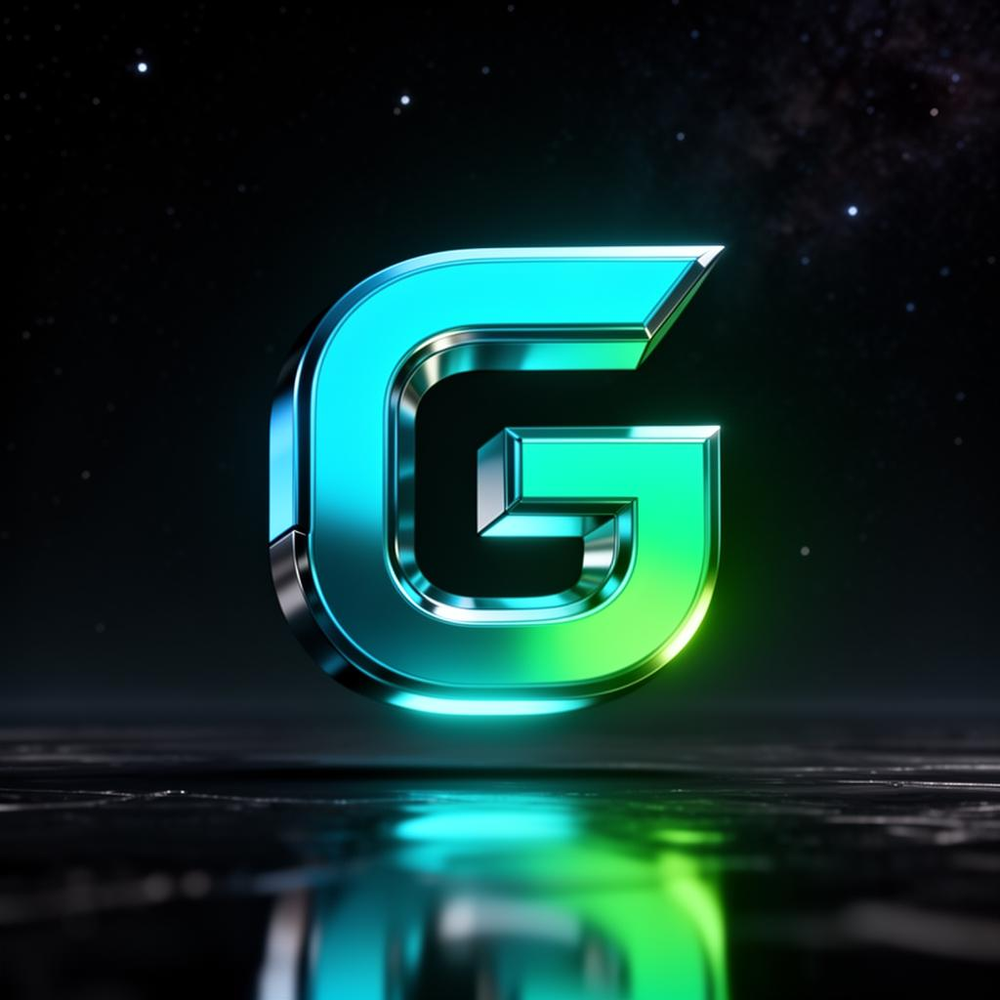

  

<h1 align="center">GasFree - TRON 免 Gas 转账服务</h1>

  <strong>人人都可享用的经济便捷的转账服务</strong>

  <a href="#-什么是-gasfree">什么是 GasFree</a> •
  <a href="#-核心优势">核心优势</a> •
  <a href="#-支持的功能">支持的功能</a> •
  <a href="#%EF%B8%8F-如何使用">如何使用</a> •
  <a href="#-技术栈">技术栈</a>

---

## 🚀 什么是 GasFree？

GasFree 是一个专注于 TRON 网络的**能量租赁与免 Gas 转账服务平台**。

在 TRON（波场）网络中，执行合约、转账 USDT 等操作时会消耗能量和带宽。传统情况下能量不足会自动扣除 TRX 支付手续费。

GasFree 提供了一种全新的体验：**使用 USDT 抵扣能量，不再需要每笔交易都准备 TRX**。

- 你可以使用 USDT 抵扣能量消耗
- 一次授权，多次购买
- 免除每次使用 TRX 支付能量的困扰

---

## 💡 核心优势

| 特性 | 描述 |
|------|------|
| 🪙 **更便宜的转账** | 相比传统转账方式，成本降低至原来的约 40%，用户只需以转账代币支付少量费用 |
| ⚡ **容易使用** | 无需原生代币进行转账或激活账户，降低了进入加密世界的门槛 |
| 🔐 **去中心化** | 通过更简单且去中心化的方式实现转账，最大限度地降低了敏感信息暴露的风险 |
| ✨ **更流畅的体验** | 消除了支付 Gas 的负担，用户只需签名转账，一切都会得到妥善处理 |

---

## 📋 支持的功能

| 功能 | 说明 |
|------|------|
| TRON 能量购买 | 直接用 USDT 或 TRX 购买能量 |
| TRON 免 Gas 转账 | 使用 USDT 抵扣能量，不再支付 TRX 手续费 |
| 钱包授权升级 | 一次授权即可升级成 GasFree 钱包 |
| 更低手续费 | 费用最低可至 0.1 USDT = 65,000 能量 |

---

## ⚙️ 如何使用

### 1. 打开 GasFree 官网

访问官方网站开始使用服务。

### 2. 连接你的 TronLink 钱包

确保已安装 TronLink 钱包插件，并连接到 TRON 网络。

### 3. 完成钱包授权激活

在网站中完成**首次授权**，授权过程安全可靠，不是多签，无需额外权限。

### 4. 选择购买能量方式

你可以使用以下两种方式获取能量：

- **USDT 抵扣能量**
  - 0.1 USDT = 65,000 能量（推荐）
- **TRX 购买能量**
  - 3 TRX = 65,000 能量

使用 USDT 购买通常更划算，也安全性更好。

### 5. 开始免 Gas 转账

授权完成后，后续每笔转账均可直接使用 USDT 抵扣能量，不再需要每次支付 TRX。

钱包中无需保留 TRX，就能实现 TRON 网络的无障碍转账。

---

## 📌 使用提示

> ⚠️ **注意事项**

- TRX 价格可能波动，建议优先使用 USDT 购买能量
- 购买前请查看能量池余量，确保能量足够使用
- 使用前请确认你连接的 TronLink 是官方钱包，并做好资产备份
- GasFree 提供的是抵扣能量服务，不构成投资建议

---

## 🛠️ 技术栈

本项目使用以下技术构建：

- **Vite** - 下一代前端构建工具
- **TypeScript** - 类型安全的 JavaScript
- **React** - 用于构建用户界面的 JavaScript 库
- **shadcn/ui** - 精美的 UI 组件库
- **Tailwind CSS** - 实用优先的 CSS 框架
- **Lucide React** - 精美的图标库

---

## 🔗 推荐资源

- [TronLink 钱包](https://www.tronlink.org/) - 官方 TRON 钱包

---

## 📑 免责声明

GasFree 平台提供的服务是基于 TRON 网络的能量优化方案。

在使用第三方服务前，请确保理解风险并妥善保管你的私钥和助记词。

---

  Copyright© 2024-2026 GasFree. All rights reserved.

